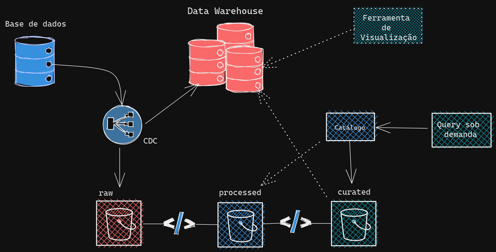

# Delivery Center - Fluxo



## Proposta

A ideia foi representar o fluxo de dados, percorrendo de forma geral:

- Ingestão dos dados na base transacional
- Extração dos dados da base transacional, simulando o CDC
- Replicação dos dados em base analítica, que representada um DW
- Carga dos dados no repositório de dados, que representa a camada "raw" do datalake
- Scripts python para efetuar o "Extract e Load" dos dados

*Por limitações da máquina local, não foi possível reproduzir o ambiente com o Spark*

## Instalação

Para utlizar a aplicação desenvolvida, precisaremos realizar as seguintes etapas:

Primeiramente será necessário realizar a clonagem do repositório:

```shell
# Cria um repositório local com base no remoto

git clone <github/repo/b-r-u-n-o>

```
No diretório do projeto, abra o terminal e execute:
```shell
# Realiza a construção dos diretórios necessários
# Cria o ambiente virtual com pipenv
# Instala as dependências do Pipfile

make init
```
Após a conclusão das instalações das dependências, caso o ambiente virtual não seja inicializado basta inserir o comando:
```shell

pipenv shell
```
Para construir toda a infraestrutura, é necessária a instalação do Docker, após instalado e inicializado, no diretório `infra` executar o comando no terminal:
```shell
# Iniciará a montagem da infraestrutura, 
# caso queira ver os logs da execução 
# retirar o `-d` do comando

docker-compose up -d
```
Com a infra em funcionamento é possível executar o arquivo python setup/ingestor.py:
```shell

python -m ingestor.py
```
Que efetuará a carga dos arquivos.csv no diretório `/datasets` para o banco de dados

Após a conclusão, é possível executar o `setup/data_migration.py`, que realizará a replicação dos dados para o Data Warehouse, e também, para a Camada Raw do Data Lake
```shell

python -m data_migration.py
```

## Autor

- [Bruno Soares](https://www.linkedin.com/in/tsbruno/)

## Construido com

- [Docker](https://www.docker.com/products/docker-desktop): Usado para construir toda a infraestrutura necessária:
  - [PostgreSQL](https://hub.docker.com/_/postgres): imagem oficial utilizada para os bancos relacionais e ana
  - [Metabase](https://hub.docker.com/r/metabase/metabase): imagem oficial Metabase para construir as visualizações
  - [Spark](https://hub.docker.com/r/bitnami/spark): imagem Bitnami para utilizar o framework Apache Spark, localmente _não usada_ 
- [Python-3.8](https://www.python.org/downloads/release/python-385/): Linguagem usada para o desenvolvimento do "EL"
- [Pandas-1.3.3](https://pandas.pydata.org/docs/getting_started/install.html): Framework para trabalhar com dados em formatos de tabulares
- [Sqlalchemy](https://pypi.org/project/SQLAlchemy/): Framework para criar as conexões com bancos de dados
- [Psycopg2-binary](https://pypi.org/project/psycopg2-binary/): Driver necessário para a conexão com o PostgreSQL


## Licença

Este projeto está sob a licença MIT 2.0 - veja o arquivo [LICENSE](./LICENSE) para mais detalhes.